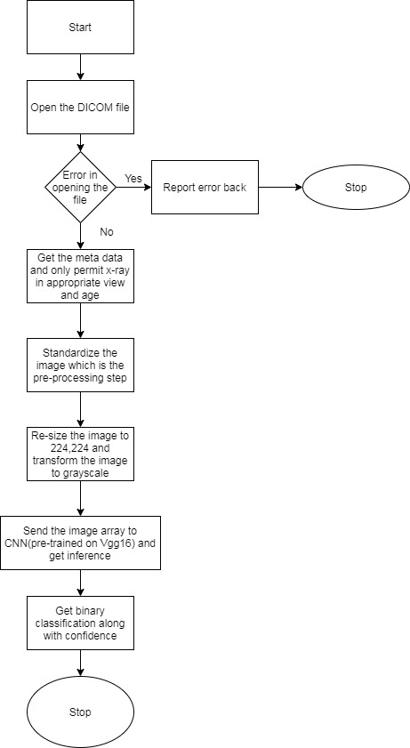
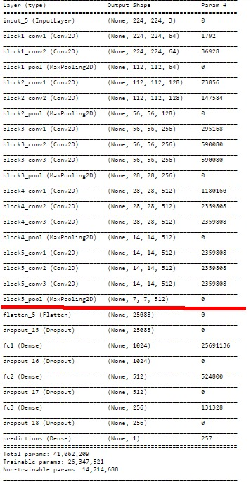
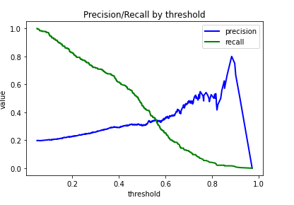
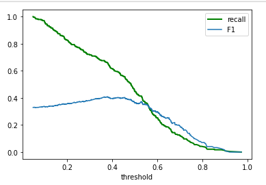
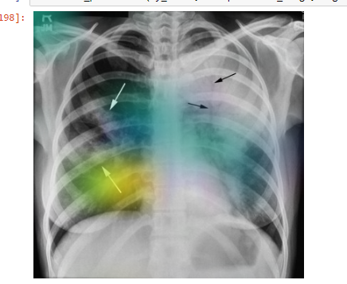

## FDA  Submission

**Your Name:** Gowtham Balachandhiran

**Name of your Device:** Pneumonia indicator in X-ray(PIX)

## Algorithm Description 

### 1. General Information

**Intended Use Statement:** 
The modality is used in assisting the radiologist to quickly identify those records associated with images that has indicators of Pneumonia.

**Indications for Use:**
The model is used to detect Pneumonia presence in x-ray. The model can be used on patients with age more than 2.

X-Ray image properties:

Body part: Chest
Position: AP (Anterior/Posterior) or PA (Posterior/Anterior)
Modality: DX (Digital Radiography)

**Device Limitations:**

The model is only used to detect Pneumonia . Presence or absence of comorbid conditions is not handled with this modality.
For example if the image has indicators of Pneumonia in radiology image but when it has effusion along with Pneumonia the modality does not have the capacity at this point in time to detect effusion along with Pneumonia nor if the image just has effusion it is going to detect the image as no Pneumonia.

**Clinical Impact of Performance:**

In terms of predictive power:

If the model predicts negative, it is confident nearly 80% of the times that it is going to be negative
Now false positve is a problem when the modality detects positive cases it could do that with more than 20% confidence.

Recall: 0.77,  precision: 0.24, F1: 0.36 , threshold: 0.25

Therefore, the algorithm is recommended for assisting a radiologist screening those images that most probably do not contain Pneumonia, to prioritize his/her time and attention to those that potentially do. This should lead to those that require medical attention getting it much faster.

### 2. Algorithm Design and Function

Design and flow of modality

**DICOM Checking Steps:**

The algorithm performs the following checks on the DICOM image:

- Validate patient age is greater than 2
- Check examined body part is 'CHEST'
- Check Patient Position is either 'PA' (Posterior/Anterior) or 'AP' (Anterior/Posterior)
- Check Modality is 'DX' (Digital Radiography)

**Preprocessing Steps:**

Pre-processing steps are as follows

Converts RGB to Grayscale (if needed)
Re-sizes the image to 244 x 244 (as required by the CNN)
Standardize the image to normal distribution by subtracting the mean value and diving by standard deviation

**CNN Architecture:**
We used Vgg16 pre-trained weights on imagenet.

Now we added additional layers to the on right of vgg16 pre-trained model

Everything you see below red line are layers added tto fine tune and not part of original vgg16.

### 3. Algorithm Training

**Parameters:**
* Types of augmentation used during training

We used normalize_meanstd function to normalise the image and did not depend on Keras pre-processing module

featurewise_std_normalization=True => This will help us standardize the image

horizontal_flip=True => This will flip the images horizontally(Will synthesize more Images)

vertical_flip=False => Not applicable for medical images

height_shift_range=0.15 => Shift in height with 15% expected

width_shift_range=0.05 => Shift at breadth level 5% expected

rotation_range=20 = > Generate images rotated

shear_range=0.1 => Images pulled to its sides at top and bottom

zoom_range=0.1 => Maximum amount of zoom permitted

* Batch size = 200

* Optimizer learning rate = 1e-3

* Layers of pre-existing architecture that were frozen = 17 layers

* Layers of pre-existing architecture that were fine-tuned

The last 2 layers of VGG16 network: block5_conv3 + block5_pool

* Layers added to pre-existing architecture

Flatten()
Dense(1024), activation = Relu
Dropout(0.2)
Dense(512) activation=Relu
Dropout(0.2)
Dense(256) activation=Relu
Dropout(0.2)
Dense(1) activation='sigmoid' ===> This is the prediction layer

The early stopping with patience of 30 epochs was used to stop the learning process.We could see the loss is flattening

We did try different learning rates but the graph of loss was only getting wobbly. Also we used Adam for reducing this effect.

We can see the idle trad-off between precision and recall lingering at 0.5. Also I kept recall in mind since recall is more important than precision in medical domain. So my decision is give more priority to recall

true negative = 395
False positive = 568
False Negative = 54
True positive = 183

This is when the threshold is greater than 25.

Recall: 0.77,  precision: 0.24, F1: 0.36 , threshold: 0.25

### 4. Databases
 (For the below, include visualizations as they are useful and relevant)

**Description of Training Dataset:** 

Training dataset consisted of 2290 chest xray images, with a 50/50 split between positive and negative cases.

**Description of Validation Dataset:**

Validation dataset consisted of 1430 chest xray images, with 20/80 split between positive and negative cases, which more reflects the occurence of pneumonia in the real world.

### 5. Ground Truth
The labels include 14 common thoracic pathologies (Pneumonia being one of them):

Atelectasis
Consolidation
Infiltration
Pneumothorax
Edema
Emphysema
Fibrosis
Effusion
Pneumonia
Pleural thickening
Cardiomegaly
Nodule
Mass
Hernia

Now there are some images which were smuddged but a little more good samples could not hurt but improve the model.

### 6. FDA Validation Plan

**Patient Population Description for FDA Validation Dataset:**

The following population subset is to be used for the FDA Validation Dataset:

Both men and women
Age 2 or greater
This modality is best put to use when it is used to detect Pneumonia from chest x-ray

**Ground Truth Acquisition Methodology:**

Preparing the ground truth depends on time, effort and cost.

The term ground truth typically refers to information acquired from direct observation (such as biopsy or laboratory results). Image labels are annotations performed by medical experts such as radiologists. These annotations can be considered ground truth if imaging is the reference standard (eg, pneumothorax). Choosing the appropriate label for a given imaging AI application requires a balance between finding the best discriminating categories (ie, normal vs emergent) and clinically relevant granularity (ie, subtype of liver lesion) depending on the desired task. With the exception of AI methods that enhance image quality, medical images in isolation are generally not suitable for developing diagnostic AI models unless associated with a diagnosis through the free-text radiology report

Reference : https://www.ncbi.nlm.nih.gov/pmc/articles/PMC7104701/

**Algorithm Performance Standard:**

According to the paper 

https://www.sciencedirect.com/science/article/abs/pii/S0263224120305844

The first and second models achieve a validation accuracy of 85.26% and 92.31% respectively. The accuracy of VGG16, VGG19, ResNet50 and Inception-v3 are 87.28%, 88.46%, 77.56% and 70.99% respectively.

We did acheive a maxmimum binary accuracy of 78% but I would not consider this alone.

In medical imaging world accuracy ,just cannot play a vital role because in real world data could be imbalanced and its distribution could become debatable.

I would rather give importance to F1(Harmonic mean of precision and recall) and recall which will have an impact towards false negative.

the industry standard is Ranked #1 on Multi-class Classification on COVID-19 CXR Dataset is 0.85 F1 our is 0.36 way lower but in time and more research I feel we could do better

### 7.Model explanation

I have used a picture from the internet which is Pneumonia positive. I have sent the image to model and created a heat map to see which areas of x-ray has indicators and seems it was able to capture most of it since I used visually annotated image from internet marked by arrows.

